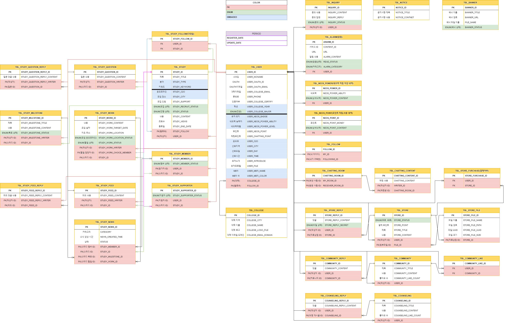

# 📘 neos-project 📘
- 대학생 스터디 모집 커뮤니티 플랫폼

## ✏ 프로젝트 목적 
- 대학생들을 위한 스터디 모집 및 정보 공유 서비스로써, 기본적인 커뮤니티 게시판과 프라이빗한 고민 상담 게시판 서비스도 운영하고 있으며, 원하는 자료를 사고파는 자료 상점을 통해 정보를 공유할 수 있고, 스터디 모집 기능으로 평소 알고 싶고 부족했던 부분을 같이 공유하며 역량을 향상 시킬 수 있는 웹서비스입니다.

## 💻 구현 기술 스택 
- JDK 11.0.15
- Oracle (11g)
- Jpa
- SpringBoot 2.7.5
- Thymeleaf
- HTML, CSS, JS
- JQuery 3.6
- QueryDsl 5.0
- AJAX
- WebSocket
- Quartz
- OAuth 2.0 Naver/Kakao/Google
- KakaoMap api
- Summernote api 
- BootPay api
- Gmail api
 
## ⛏ 테스트 환경
- Junit 5.0
- Postman

## 💬 Dependency
- Gradle

## 💡 프로젝트에서 맡은 역할 
* 1:1 채팅 부분
  - WebSocket을 사용하여 1:1 채팅 구현
  - 채팅방 만들기 기능 구현
  - 채팅방 나가기 기능 구현
  - 여러 채팅방 목록 

## ERD

# 느낀 점
- jsp와는 다르게 개발속도가 확연히 빨랐으며, 스프링 mvc 패턴에 대한 이해와 aop, interceptor, bean들에 대한 이해를 조금 더 할 수 있어서 좋았다.
jsp 프로젝트보다 테이블 갯수도 3배 정도 많았고, 서비스도 훨씬 많았지만 맡은 부분에 있어서 완성을 할 수 있다는 점이 뿌듯했고, 
spring과 jpa, queryDSL이라는 기술에 대해 더 깊은 공부를 하고 싶다는 생각이 들었다.
